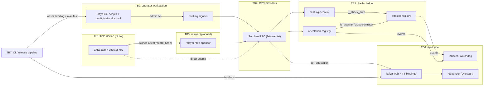

# Contract-Layer Threat Model (STRIDE)

This is the authoritative threat model for the **contract layer** in this
repository: the three Soroban contracts, the operator CLI and scripts, network
config, the LRC record-commitment scheme, and the generated bindings. The
project-wide threat model (field workflow, web app, people and process) lives
in `lafiya-docs`. This document goes deeper on the contracts and cites that
one only where the two boundaries meet.

Use this document to decide whether a change raises or lowers risk. PRs answer
**"Does this change affect the threat model?"** in the PR template. If the
answer is yes, update the relevant table or attack-tree leaf in the same PR.

Status labels used on every leaf:

- **mitigated (by …)**: a control exists in code or process today.
- **accepted (ADR …)**: a deliberate, documented trade-off.
- **open (#…)**: a known gap with a tracking issue.

Issue links point to [Lafiya-xyz/Lafiya-contract](https://github.com/Lafiya-xyz/Lafiya-contract/issues).
There is no security traceability registry yet. [#380](https://github.com/Lafiya-xyz/Lafiya-contract/issues/380)
will map each leaf below to a regression test.

## 1. Assets

| # | Asset | Why it matters |
|---|---|---|
| A1 | **Allowlist integrity** (`attester-registry`) | Only licensed, active CHWs may attest. Everything downstream trusts `is_attester`. |
| A2 | **Attestation integrity** (`attestation-registry`) | A responder acts on "verified". A forged or wrongly surviving attestation can mislead emergency care. |
| A3 | **Verification availability** | `get_attestation` must answer when a card is scanned in an emergency. |
| A4 | **Admin authority** | Controls the allowlist, pause, revocation, registry wiring, and rate limits. |
| A5 | **Upgrade authority** | `attester-registry::upgrade` replaces the code outright. It is the most powerful admin action. |
| A6 | **Patient privacy**: commitment unlinkability and hiding | Record hashes are public. They must reveal nothing about the record (e.g. genotype) and must not link one patient's records across time or sites. |
| A7 | **CHW privacy** | Attester addresses, activity, and `AttesterInfo` (`license_hash`, `region`) are public and can profile or target individual health workers. |

## 2. Actors and trust levels

| Actor | Trust | Capabilities |
|---|---|---|
| **Admin quorum** (`multisig-account` N-of-M) | Fully trusted within the ADR-0007 scope | Every admin-gated function. Signatures are **not scoped** to target contract or function (ADR-0007). |
| **Registrars** | Not yet introduced ([#329](https://github.com/Lafiya-xyz/Lafiya-contract/issues/329), [#328](https://github.com/Lafiya-xyz/Lafiya-contract/issues/328)) | Would enrol attesters within a quota. |
| **Attester: honest** | Trusted for the records they attest | `attest` while allowlisted. |
| **Attester: compromised key** | Untrusted | Everything an honest attester can do, at machine speed. |
| **Attesters: colluding** | Untrusted | Coordinated false attestations, spread across keys to stay under per-key limits. |
| **Responder** | Untrusted reader | Calls read-only views via RPC or the web app. |
| **Patient** | Untrusted w.r.t. contracts | Holds the card and QR code. Has no on-chain role today ([#341](https://github.com/Lafiya-xyz/Lafiya-contract/issues/341)). |
| **Anonymous chain observer** | Untrusted | Reads all ledger state and events, and runs offline dictionary attacks. |
| **RPC provider** | Semi-trusted for availability, untrusted for integrity | Can drop, delay, or lie about reads. Cannot forge signatures. |
| **Relayer** | Semi-trusted (planned, [#347](https://github.com/Lafiya-xyz/Lafiya-contract/issues/347)) | Would submit CHW-signed transactions and pay fees. Could censor or delay them. |
| **CI / release pipeline** | Trusted, but a high-value target | Builds the wasm whose hash admins upgrade to. |
| **Dependency authors** (crates, actions, stellar-cli) | Partially trusted | Code runs in builds and in operator tooling. |

## 3. Data flow and trust boundaries

Every arrow that crosses a TB box is a trust boundary. The only boundary
enforced **on-chain** is TB5 (Soroban `require_auth` plus `__check_auth`).
Everything else relies on off-chain controls.

## 4. STRIDE per component

### `attester-registry`

| STRIDE | Threat | Status |
|---|---|---|
| S | Someone other than the admin adds attesters | mitigated (by `admin.require_auth()` on every mutator) |
| T | Admin key or quorum compromise rewrites the allowlist | accepted ([ADR-0003](../adr/0003-single-admin-initial-model.md), [ADR-0007](../adr/0007-unscoped-multisig-authorization.md)); open ([#399](https://github.com/Lafiya-xyz/Lafiya-contract/issues/399), [#369](https://github.com/Lafiya-xyz/Lafiya-contract/issues/369)) |
| T | Re-adding an attester silently wipes metadata; an orphaned `Suspended` key makes new attesters "born suspended" | open ([#322](https://github.com/Lafiya-xyz/Lafiya-contract/issues/322), [#324](https://github.com/Lafiya-xyz/Lafiya-contract/issues/324)) |
| R | Allowlist changes are not attributable after the fact | mitigated (by `AttesterAdded` / `Removed` / `Suspended` / `Reinstated` events); open for reason codes ([#334](https://github.com/Lafiya-xyz/Lafiya-contract/issues/334)) and timestamps ([#333](https://github.com/Lafiya-xyz/Lafiya-contract/issues/333)) |
| I | `AttesterInfo.region` and `license_hash` profile CHWs | accepted ([ADR-0001](../adr/0001-hash-only-on-chain-footprint.md): hashes and coarse region only); open ([#436](https://github.com/Lafiya-xyz/Lafiya-contract/issues/436)) |
| D | Instance or entry TTL expiry makes `is_attester` fail | mitigated (by TTL extension on writes, [`contract-upgrade.md`](../runbooks/contract-upgrade.md)) |
| D | Batch operations exceed per-transaction limits | open ([#321](https://github.com/Lafiya-xyz/Lafiya-contract/issues/321)) |
| E | Malicious `upgrade()` replaces the code | accepted (ADR-0003/0007: admin is fully trusted); open ([#368](https://github.com/Lafiya-xyz/Lafiya-contract/issues/368), [#369](https://github.com/Lafiya-xyz/Lafiya-contract/issues/369)) |

### `attestation-registry`

| STRIDE | Threat | Status |
|---|---|---|
| S | Attesting as another CHW | mitigated (by `attester.require_auth()`) |
| S | A non-allowlisted key attests | mitigated (by the cross-contract `is_attester` check, [ADR-0002](../adr/0002-contractclient-boundary.md)) |
| S | Front-running `initialize` to install an attacker admin or registry | open ([#361](https://github.com/Lafiya-xyz/Lafiya-contract/issues/361)) |
| T | Admin repoints `AttesterRegistry` to a contract that approves everyone | mitigated (by `AttesterRegistryRepointed` event plus watchdog); open (interface check on repoint [#349](https://github.com/Lafiya-xyz/Lafiya-contract/issues/349), watchdog [#414](https://github.com/Lafiya-xyz/Lafiya-contract/issues/414)) |
| T | Any attester evicts other attesters' history for a hash by re-attesting 10 times | open ([#339](https://github.com/Lafiya-xyz/Lafiya-contract/issues/339)) |
| T | A removed or compromised attester's past attestations still read as verified | accepted ([ADR-0006](../adr/0006-attestation-revocation-semantics.md)); open ([#337](https://github.com/Lafiya-xyz/Lafiya-contract/issues/337), [#400](https://github.com/Lafiya-xyz/Lafiya-contract/issues/400)) |
| R | Revocation leaves no on-chain trace, so "revoked" looks like "never attested" | open ([#343](https://github.com/Lafiya-xyz/Lafiya-contract/issues/343)) |
| I | Record-hash activity links a patient across attestations | open ([#433](https://github.com/Lafiya-xyz/Lafiya-contract/issues/433)) |
| D | Attestation flood causes rent growth and revocation burden | mitigated (by per-attester rate limit, [`storage-cost.md`](../storage-cost.md#attestation-rate-limiting)) |
| D | Registry wiring failure makes `attest` trap instead of returning an error | open ([#352](https://github.com/Lafiya-xyz/Lafiya-contract/issues/352)) |
| D | Admin `pause()` or wide `revoke_attestation` | accepted (ADR-0003: admin trusted); open ([#365](https://github.com/Lafiya-xyz/Lafiya-contract/issues/365), [#364](https://github.com/Lafiya-xyz/Lafiya-contract/issues/364)) |
| E | Admin transfer to a mistyped address, or a stale pending admin | open ([#330](https://github.com/Lafiya-xyz/Lafiya-contract/issues/330)) |

### `multisig-account`

| STRIDE | Threat | Status |
|---|---|---|
| S | Forged signer signatures | mitigated (by ed25519 verification in `__check_auth` over the Soroban payload) |
| T/E | A quorum signature authorizes a call the signers did not intend (unscoped contexts) | accepted ([ADR-0007](../adr/0007-unscoped-multisig-authorization.md)); open ([#406](https://github.com/Lafiya-xyz/Lafiya-contract/issues/406)) |
| R | No record of which signers approved what | open ([#360](https://github.com/Lafiya-xyz/Lafiya-contract/issues/360)) |
| D | Quorum lost (keys lost), so admin is frozen forever | open ([#358](https://github.com/Lafiya-xyz/Lafiya-contract/issues/358), [#355](https://github.com/Lafiya-xyz/Lafiya-contract/issues/355)) |
| I | Signer set not introspectable, which hides misconfiguration | open ([#359](https://github.com/Lafiya-xyz/Lafiya-contract/issues/359)) |

### CLI, scripts, and config

| STRIDE | Threat | Status |
|---|---|---|
| S | Signing against the wrong network or a look-alike contract ID | open ([#401](https://github.com/Lafiya-xyz/Lafiya-contract/issues/401), [#403](https://github.com/Lafiya-xyz/Lafiya-contract/issues/403)) |
| T | `config env` output allows command injection when eval'd | open ([#396](https://github.com/Lafiya-xyz/Lafiya-contract/issues/396)) |
| R | No operator audit trail | open ([#417](https://github.com/Lafiya-xyz/Lafiya-contract/issues/417)) |
| I | Admin secrets passed as workflow inputs or env | open ([#424](https://github.com/Lafiya-xyz/Lafiya-contract/issues/424)) |
| D | RPC outage or a lying RPC stalls operations or verification | mitigated (by failover design, [ADR-0011](../adr/0011-rpc-provider-failover-and-transaction-recovery.md)); open (production provider [#404](https://github.com/Lafiya-xyz/Lafiya-contract/issues/404)) |
| E | Signers approve an opaque auth tree | open ([#406](https://github.com/Lafiya-xyz/Lafiya-contract/issues/406), [#398](https://github.com/Lafiya-xyz/Lafiya-contract/issues/398)) |

### Commitment scheme (LRC-1)

| STRIDE | Threat | Status |
|---|---|---|
| S/T | Two implementations canonicalize differently, so a valid card fails to verify (or the wrong card verifies) | mitigated (by domain tag, version byte, and test vectors, [ADR-0008](../adr/0008-record-commitment-canonicalization.md)); open ([#387](https://github.com/Lafiya-xyz/Lafiya-contract/issues/387), [#381](https://github.com/Lafiya-xyz/Lafiya-contract/issues/381), [#382](https://github.com/Lafiya-xyz/Lafiya-contract/issues/382)) |
| I | Low-entropy fields (genotype, blood group) recovered by dictionary attack | mitigated (by salt in LRC-1); open (enforce a high-entropy salt [#383](https://github.com/Lafiya-xyz/Lafiya-contract/issues/383)) |
| D | Oversized or malformed input panics the encoder | open ([#386](https://github.com/Lafiya-xyz/Lafiya-contract/issues/386)) |

### Bindings, SDK, and release pipeline

| STRIDE | Threat | Status |
|---|---|---|
| T | Bindings drift from the deployed contract, so the web app misreads results | mitigated (by `check_bindings_drift.py`, locally); open (run in CI [#448](https://github.com/Lafiya-xyz/Lafiya-contract/issues/448)) |
| T | Consumers misinterpret the verification result (e.g. treat "attested by since-removed CHW" as fully verified) | open ([#441](https://github.com/Lafiya-xyz/Lafiya-contract/issues/441), [#351](https://github.com/Lafiya-xyz/Lafiya-contract/issues/351)) |
| T | Compromised action or crate injects code into the release wasm | open ([#421](https://github.com/Lafiya-xyz/Lafiya-contract/issues/421), [#422](https://github.com/Lafiya-xyz/Lafiya-contract/issues/422)) |
| R | Nobody can prove which source produced the deployed wasm | open ([#418](https://github.com/Lafiya-xyz/Lafiya-contract/issues/418), [#419](https://github.com/Lafiya-xyz/Lafiya-contract/issues/419)) |

## 5. Attack trees

Children are OR unless marked **AND**.

### G1. Make a fabricated record show as "verified" to a responder

- **1.1 Get a valid attestation for a fabricated record hash**
  - 1.1.1 Compromise an allowlisted CHW key: **open** ([#436](https://github.com/Lafiya-xyz/Lafiya-contract/issues/436)). Blast radius bounded by the rate limit, **mitigated (by #444 rate limiting)**. Detection: **open** ([#415](https://github.com/Lafiya-xyz/Lafiya-contract/issues/415)).
  - 1.1.2 Bribe or collude with a CHW: **accepted** (a human-trust problem, handled in the `lafiya-docs` threat model). Patient-consent binding: **open** ([#341](https://github.com/Lafiya-xyz/Lafiya-contract/issues/341)).
  - 1.1.3 Get an attacker key allowlisted
    - Compromise the admin quorum (see G4).
    - Social-engineer a registrar or admin with a fake licence: **open** ([#326](https://github.com/Lafiya-xyz/Lafiya-contract/issues/326), [#392](https://github.com/Lafiya-xyz/Lafiya-contract/issues/392)).
  - 1.1.4 Admin repoints `AttesterRegistry` to a permissive contract: **open** ([#349](https://github.com/Lafiya-xyz/Lafiya-contract/issues/349), [#414](https://github.com/Lafiya-xyz/Lafiya-contract/issues/414)).
  - 1.1.5 Front-run `initialize` with an attacker registry: **open** ([#361](https://github.com/Lafiya-xyz/Lafiya-contract/issues/361)).
  - 1.1.6 Attester acts outside their region: **open** ([#327](https://github.com/Lafiya-xyz/Lafiya-contract/issues/327)).
- **1.2 Keep a no-longer-valid attestation looking verified**
  - 1.2.1 Rely on an attestation made before the CHW was removed or compromised: **accepted** ([ADR-0006](../adr/0006-attestation-revocation-semantics.md)); **open** ([#337](https://github.com/Lafiya-xyz/Lafiya-contract/issues/337), [#400](https://github.com/Lafiya-xyz/Lafiya-contract/issues/400)).
  - 1.2.2 Present an outdated card after the record changed: **open** ([#345](https://github.com/Lafiya-xyz/Lafiya-contract/issues/345), [#340](https://github.com/Lafiya-xyz/Lafiya-contract/issues/340)).
- **1.3 Fool the reader, not the chain** (**AND**: the responder trusts the display)
  - 1.3.1 Malicious or compromised RPC returns a fake `get_attestation`: **open** (ADR-0011 covers availability, not integrity; offline receipts [#390](https://github.com/Lafiya-xyz/Lafiya-contract/issues/390)).
  - 1.3.2 Forged QR payload pointing at another hash: **open** ([#389](https://github.com/Lafiya-xyz/Lafiya-contract/issues/389)).
  - 1.3.3 Commitment canonicalization mismatch lets a different record match: **mitigated (by ADR-0008)**; **open** ([#387](https://github.com/Lafiya-xyz/Lafiya-contract/issues/387)).
  - 1.3.4 The web app renders "verified" for an ambiguous verdict: **open** ([#441](https://github.com/Lafiya-xyz/Lafiya-contract/issues/441), [#437](https://github.com/Lafiya-xyz/Lafiya-contract/issues/437)).

### G2. Learn a patient's genotype from public data

- **2.1 Invert the record hash**
  - 2.1.1 Dictionary attack over a small field space (**AND**: weak or reused salt, AND the attacker knows the other fields): **mitigated (by LRC-1 salt, ADR-0008)**; **open** ([#383](https://github.com/Lafiya-xyz/Lafiya-contract/issues/383)).
  - 2.1.2 Canonicalization flaw leaks structure: **mitigated (by ADR-0008 domain separation)**.
- **2.2 Correlate metadata**
  - 2.2.1 Link the same patient across attestations or sites by hash reuse and timing: **open** ([#433](https://github.com/Lafiya-xyz/Lafiya-contract/issues/433)).
  - 2.2.2 Infer the condition from which clinic or CHW (`AttesterInfo.region`) attested: **accepted** ([ADR-0001](../adr/0001-hash-only-on-chain-footprint.md)); **open** ([#432](https://github.com/Lafiya-xyz/Lafiya-contract/issues/432)).
- **2.3 Health data placed on-chain directly**: **mitigated (by ADR-0001: contracts accept only `BytesN<32>`)**.

### G3. Permanently deny verification service

- **3.1 Remove attestations**
  - 3.1.1 Evict history by re-attesting a hash: **open** ([#339](https://github.com/Lafiya-xyz/Lafiya-contract/issues/339)).
  - 3.1.2 Malicious `revoke_attestation` by a compromised admin: see G4. **Open** ([#343](https://github.com/Lafiya-xyz/Lafiya-contract/issues/343)) so that revocations stay visible.
  - 3.1.3 Entries archived by TTL expiry: **mitigated (by TTL extension on write, 90 days)**. Automatic restore on read is **open** ([#379](https://github.com/Lafiya-xyz/Lafiya-contract/issues/379) measures the real rent and TTL budget).
- **3.2 Block the contract**
  - 3.2.1 Admin `pause()` indefinitely: **accepted** (ADR-0003); **open** ([#365](https://github.com/Lafiya-xyz/Lafiya-contract/issues/365)).
  - 3.2.2 Admin quorum lost, so a bad state cannot be fixed: **open** ([#358](https://github.com/Lafiya-xyz/Lafiya-contract/issues/358)).
  - 3.2.3 Registry wiring broken, so `attest` traps: **open** ([#352](https://github.com/Lafiya-xyz/Lafiya-contract/issues/352)).
  - 3.2.4 Malicious `upgrade()` bricks `attester-registry`: see G4.
- **3.3 Block access**
  - 3.3.1 All configured RPC providers down or censoring: **mitigated (by ADR-0011 failover)**; **open** ([#404](https://github.com/Lafiya-xyz/Lafiya-contract/issues/404), [#390](https://github.com/Lafiya-xyz/Lafiya-contract/issues/390)).
  - 3.3.2 Relayer censors CHW submissions: **open** ([#347](https://github.com/Lafiya-xyz/Lafiya-contract/issues/347)). CHWs can still submit directly.
  - 3.3.3 Testnet reset wipes state: **accepted** (testnet only); **open** ([#425](https://github.com/Lafiya-xyz/Lafiya-contract/issues/425)).

### G4. Take over admin authority

- **4.1 Compromise signer keys** (**AND**: reach threshold)
  - 4.1.1 Steal keys from operator machines: **open** ([#399](https://github.com/Lafiya-xyz/Lafiya-contract/issues/399)).
  - 4.1.2 Trick signers into signing a malicious auth tree: **accepted** ([ADR-0007](../adr/0007-unscoped-multisig-authorization.md)); **open** ([#406](https://github.com/Lafiya-xyz/Lafiya-contract/issues/406), [#398](https://github.com/Lafiya-xyz/Lafiya-contract/issues/398)).
  - 4.1.3 Quorum shared with the treasury: **mitigated (by separate trust boundaries, [ADR-0009](../adr/0009-treasury-asset-custody-model.md))**.
- **4.2 Abuse admin handover**
  - 4.2.1 Front-run `initialize` on a fresh deployment: **open** ([#361](https://github.com/Lafiya-xyz/Lafiya-contract/issues/361), [#362](https://github.com/Lafiya-xyz/Lafiya-contract/issues/362)).
  - 4.2.2 Exploit a stale `PendingAdmin`: **open** ([#330](https://github.com/Lafiya-xyz/Lafiya-contract/issues/330)).
  - 4.2.3 Single-key admin in use: **accepted** (pre-alpha only, [ADR-0003](../adr/0003-single-admin-initial-model.md)). Must be multisig before mainnet.
- **4.3 Subvert the code the admin upgrades to**
  - 4.3.1 Supply-chain compromise of the build: **open** ([#421](https://github.com/Lafiya-xyz/Lafiya-contract/issues/421), [#422](https://github.com/Lafiya-xyz/Lafiya-contract/issues/422)).
  - 4.3.2 Admin cannot verify the wasm hash they sign: **mitigated (by the expected-hash step in [`contract-upgrade.md`](../runbooks/contract-upgrade.md))**; **open** ([#418](https://github.com/Lafiya-xyz/Lafiya-contract/issues/418), [#419](https://github.com/Lafiya-xyz/Lafiya-contract/issues/419)).
- **4.4 Privileged action goes unnoticed**: **open** ([#414](https://github.com/Lafiya-xyz/Lafiya-contract/issues/414), [#369](https://github.com/Lafiya-xyz/Lafiya-contract/issues/369)).

## 6. Residual risk by gate

| Gate | Must be closed before the gate | Residual risk accepted at the gate |
|---|---|---|
| **Pre-alpha** (now: local and unit-tested) | nothing | Everything marked open. Single admin (ADR-0003), unscoped multisig (ADR-0007), immutable attestations (ADR-0006). No real patient data may be used. |
| **Testnet** (pilot with synthetic data) | #361 (initialize front-running), #339 (history eviction), #352 (trap on wiring failure), #396 (CLI injection), rate limits configured (#444) | Unscoped multisig (ADR-0007), no compromise window (#337), RPC integrity (1.3.1), no watchdog (#414). Mitigated by synthetic data and testnet resets. |
| **Mainnet** (real patients) | All of the testnet list, plus multisig admin with hardware keys (#399, #398), watchdog (#414), salt enforcement (#383), linkability analysis (#433, #432), reproducible builds (#418), supply-chain hardening (#421), compromise handling (#337 or #400), verification-result model (#441), external audit (#434) | ADR-0007 only if #406 gives signers a human-readable review. RPC integrity through multi-provider cross-checks. Colluding CHWs (1.1.2) handled by human process. |

## Maintenance

- Review this document at every milestone gate and whenever an ADR is added
  or superseded.
- When an issue linked here closes, update its leaf to **mitigated (by …)**.
